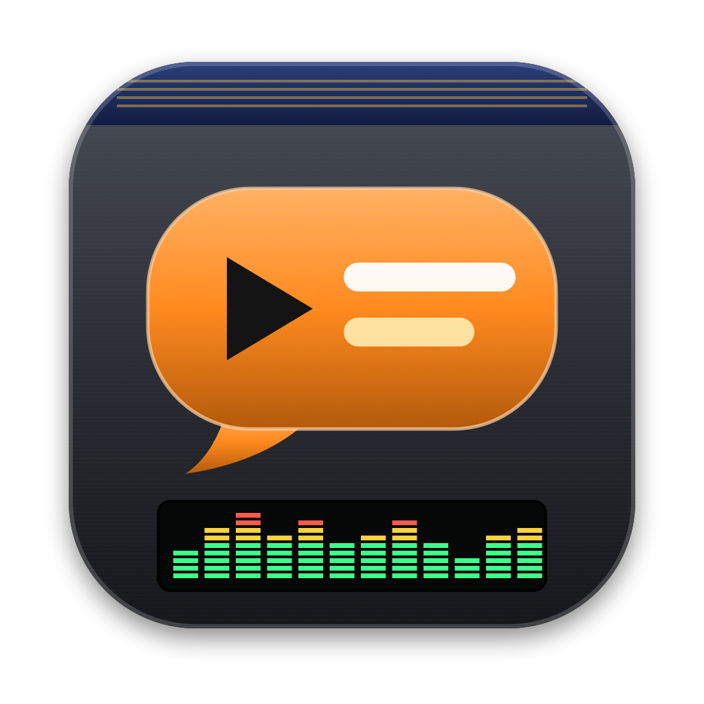

# YouTube Live Translator

A small Rust browser (tao + wry) with a **VLC × Winamp** style interface. It plays a YouTube video from its URL and shows **generated and translated subtitles**, from and to **Arabic, French, English, German, Turkish and Spanish**.

Everything runs **locally on your Mac**:
- **Transcription:** Whisper, compiled into the app.
- **Translation:** NLLB, compiled into the app.
- **No API or account needed.** The only external tool is `yt-dlp`, which reads YouTube.



---

## Contents

1. [Features](#features)
2. [Installation](#installation)
3. [First launch](#first-launch)
4. [How-to guide](#how-to-guide)
5. [Settings (⚙)](#settings-)
6. [Keyboard shortcuts](#keyboard-shortcuts)
7. [Update](#update)
8. [Uninstall](#uninstall)
9. [Troubleshooting](#troubleshooting)
10. [How it works](#how-it-works)
11. [Development](#development)
12. [Security](#security)
13. [Third-party licenses](#third-party-licenses)
14. [License and disclaimer](#license-and-disclaimer)

---

## Features

- **Native video playback** from a YouTube URL, with an iframe player as a fallback.
- **Subtitles**, from one of two sources:
  - YouTube's own subtitles, manual or automatic;
  - a **local transcription with Whisper**, which also works on songs.
- **Offline translation** between 6 languages with NLLB-200. Google, Claude and YouTube's automatic translation are also available.
- **Progressive display:** subtitles appear as they're transcribed and translated, about 7 s after you open a video.
- **Two-line mode:** the original text and its translation, one above the other.
- **Clickable transcript**, with a search filter.
- **Playlist** with history, YouTube search, and chaining into the YouTube Mix at the end of the list.
- **Export to `.srt`**.
- **Subtitle styling:** size, height, background, and sync offset.
- **Full screen**, playback speed and video quality.

---

## Installation

### Prerequisites

| Tool | Why | Install |
|---|---|---|
| macOS 12 or later (Apple Silicon recommended: Whisper runs on the GPU through Metal) | — | — |
| Xcode command line tools | C/C++ compiler | `xcode-select --install` |
| Rust (stable, edition 2024) | builds the app | https://rustup.rs |
| Homebrew | package manager | https://brew.sh |
| `cmake` | **at build time only**: compiles whisper.cpp and CTranslate2 | `brew install cmake` |
| `yt-dlp` | **at runtime**: reads YouTube | `brew install yt-dlp` |

### Build and install

```bash
git clone https://github.com/younss/youtube_live_translator.git
cd youtube_live_translator
brew install cmake yt-dlp
./scripts/install.sh
```

`install.sh` does three things:
1. It **builds** the app in release mode. The first build takes a few minutes, because of the C++ code for whisper.cpp and CTranslate2.
2. It **installs** `YouTube Live Translator.app` into `/Applications`, or into `~/Applications` if `/Applications` isn't writable.
3. It **downloads the models** once, about 1.9 GB total, into `~/Library/Caches/youtube-live-translator/models`:
   - Whisper large-v3-turbo, about 550 MB (transcription);
   - NLLB-200 1.3B int8, about 1.3 GB (translation).

Reinstalling the app never downloads the models again.

### Other install options

| Command | Result |
|---|---|
| `./scripts/bundle.sh` | builds `target/YouTube Live Translator.app` without installing it |
| `./scripts/dmg.sh` | builds `target/YouTube-Live-Translator.dmg`: open it and drag the app onto *Applications*. The models download on first launch. |
| `cargo run --release` | runs the app straight from the source code |
| `cargo run --release -- --setup` | downloads the models only |

---

## First launch

1. Open **YouTube Live Translator** from *Applications*, Launchpad or Spotlight.
2. If the models aren't there yet (for example, installed from the DMG), the bar at the bottom of the SOUS-TITRES panel shows **INSTALLATION DES MODÈLES…**. Wait for **MODÈLES PRÊTS**.
3. The status bar at the bottom of the window shows the state of the components: ● green = OK, ○ red = missing.
   - `yt-dlp` must be green.
   - `clé Claude` is only needed if you use the Claude translator.

---

## How-to guide

### Open a video

1. Paste a YouTube URL into the address bar at the top, then press **OUVRIR** or `Enter`. All the usual forms work:
   - `https://www.youtube.com/watch?v=…`
   - `https://youtu.be/…`
   - `/shorts/…`, `/live/…`, `/embed/…`
   - links with `&list=…`: the playlist is ignored and only the video is opened.
2. The video starts, and **subtitles are generated automatically** with the current settings. The exception is the Claude translator, which requires clicking **GÉNÉRER**.

The **◀ ▶** buttons in the navigation bar go through your history, and **⟳** reloads the current video.

### Search for a video

1. Type words instead of a URL in the address bar, for example `sezen aksu git`, then press `Enter`.
2. Results appear in the **RECHERCHE** tab.
   - **Double-click** plays the video and adds it to the playlist.
   - **Right-click** adds it to the playlist without playing it.

### Pick the languages

In the **SOUS-TITRES** panel:
- **DE**: the language spoken in the video. "Auto" detects it automatically; picking the exact language (for example Türkçe) improves recognition.
- **VERS**: the language of the subtitles.
- **⇄** swaps the two. This requires a specific source language, not "Auto".

Changing languages regenerates the subtitles right away. **The transcript is reused**: only the translation runs again, which takes a few seconds.

### Choose where the text comes from (SOURCE)

| Option | When to use it |
|---|---|
| **YouTube, sinon Whisper** (default) | Uses YouTube's subtitles if they exist; otherwise transcribes locally. |
| **Sous-titres YouTube** | Only YouTube's subtitles (fast, but not always available). |
| **Whisper (local)** | Always transcribes locally. Best for songs, and for videos without subtitles or with poor ones. |

### Choose the translator (TRADUCTEUR)

| Option | Upside | Limitation |
|---|---|---|
| **Local NMT (hors ligne)** (default) | Offline, free, fast, private | Guesses gender on its own, line by line |
| **Google (gratuit)** | Good quality, no key | Can block your IP after a lot of use; the app then switches to MyMemory automatically |
| **Claude (clé API)** | Best quality; handles context, gender and proper names | Requires an Anthropic API key (paid) |
| **YouTube auto** | YouTube's automatic translation | Only when YouTube offers it for the video |

### Grammatical gender (automatic)

Some languages (Arabic, French, Spanish…) mark gender, while others, like Turkish, don't. The app handles it **automatically**, and there's nothing to set:
- **With Claude:** the gender of the speaker and of the person being addressed is inferred from the context: the video title (for example, the singer's name), the lyrics as a whole, and the pronouns. For example, Arabic "you" becomes أنتَ or أنتِ as appropriate.
- **With local NMT:** the model translates line by line and chooses on its own. It isn't always right, and it can't be steered.

### Generate, regenerate, export

| Button | Action |
|---|---|
| **GÉNÉRER** | Generates the subtitles with the current settings. Results are cached, so reopening the same video is instant. |
| **REGÉNÉRER** | Ignores the cache and redoes everything: transcription and translation. |
| **EXPORT .SRT** | Saves the subtitles to `~/Downloads/<title>.<language>.srt`. With the **2L** mode on, the file holds both lines (translation + original). |

The green bar under the buttons shows progress, then a summary such as `42 SOUS-TITRES · WHISPER (LOCAL) → NMT LOCAL`. **The first subtitles show up during generation**, before it finishes.

### Adjust how subtitles look

The four vertical sliders in the SOUS-TITRES panel:
- **TAILLE**: text size.
- **HAUT.**: height of the subtitles on the video.
- **FOND**: opacity of the black background behind the text.
- **SYNC**: shifts the subtitles from −5 s to +5 s. Double-click it to reset to 0; the `[` / `]` keys adjust it in 0.1 s steps.

In the control bar:
- **CC** shows or hides the subtitles.
- **2L** shows the original (in yellow, above) plus the translation.

### Follow along with the transcript

In the **TRANSCRIPTION** tab:
- the line being spoken is highlighted and follows playback;
- **clicking a line** jumps the video to that moment;
- the filter box searches for a word in the original or the translation.

### Manage the playlist

In the **PLAYLIST** tab:
- **+ AJOUTER** adds the video from the address bar.
- **− RETIRER** removes the selected item (click once to select it).
- **VIDER** clears the whole list.
- Double-click an item to play it.

Every video you open is added automatically. At the end of the list, **Élément suivant** (⏭) or the end of a video continues with the **YouTube Mix** of the current video.

### Playback controls

- **Buttons:** ▶/❚❚ (play/pause), ⏮ / ⏭ (previous / next), ■ (stop), ↺ / ↻ (back / forward 10 s), ↻ (loop), ⛶ (full screen).
- **Progress bar:** click or drag to seek.
- **Volume:** click, drag, or use the mouse wheel.
- **NATIF / YOUTUBE:** the playback engine.
  - NATIF (recommended) uses the app's own player.
  - YOUTUBE uses the embedded player. The app switches to it automatically if the video refuses native playback, and vice versa.
- **360p … 1080p:** quality of the native player, applied to the next video you open.
- **0.5× … 2×:** playback speed.

### Full screen

Use **⛶**, `F`, or double-click the video. To exit, press `F` or `Esc`, or click ⛶ again. Moving the mouse shows the controls.

### The window

The window has its own title bar, Winamp style:
- drag the bar to move the window, and double-click it to maximize;
- the **_ □ ×** buttons reduce, maximize and close;
- the bottom-right corner resizes the window.

---

## Settings (⚙)

Open them with the **⚙** button in the SOUS-TITRES panel.

| Setting | Options |
|---|---|
| **Clé API Anthropic** | Only for the Claude translator. It's stored in the **macOS Keychain**, never in a file. Leave the field empty to keep the current key. |
| **Modèle Whisper** | tiny (75 MB), base (142 MB), small (466 MB), medium (1.5 GB), **large-v3-turbo (550 MB, recommended)**. A new model downloads on the next transcription. |
| **Traduction locale (NMT)** | **NLLB 1.3B** (better quality, ~1.4 GB RAM while translating) or **NLLB 600M** (lighter, ~650 MB RAM). |

Where things are stored:
- settings: `~/Library/Application Support/youtube-live-translator/config.json`;
- cache (transcripts, translations, models): `~/Library/Caches/youtube-live-translator/`.

---

## Keyboard shortcuts

| Key | Action |
|---|---|
| `Space` | Play / pause |
| `←` / `→` | Back / forward 5 s |
| `↑` / `↓` | Volume ±5 % |
| `M` | Mute |
| `F` | Full screen (`Esc` to exit) |
| `S` | Show / hide subtitles |
| `D` | Two lines: original + translation |
| `[` / `]` | Shift subtitles by −0.1 s / +0.1 s |
| `N` / `P` | Next / previous video |
| `G` | Generate subtitles |
| `L` | Focus the address bar |
| `⌘C` `⌘V` `⌘A` | Copy / paste / select all in text fields |

---

## Update

```bash
cd youtube_live_translator
git pull
./scripts/install.sh      # rebuilds and reinstalls; models already downloaded are kept
brew upgrade yt-dlp       # important: YouTube changes often
```

---

## Uninstall

```bash
rm -rf "/Applications/YouTube Live Translator.app"
rm -rf ~/Library/Caches/youtube-live-translator             # models (~1.9 GB) and cache
rm -rf ~/Library/Application\ Support/youtube-live-translator  # settings
security delete-generic-password -s com.younss.ytlt -a anthropic-api-key 2>/dev/null  # Claude key, if set
```

---

## Troubleshooting

| Symptom | Fix |
|---|---|
| `ERREUR : yt-dlp : …` / "unable to download" / 403 | Update yt-dlp: `brew upgrade yt-dlp`. YouTube changes its protections regularly. |
| `yt-dlp` shows red in the status bar | `brew install yt-dlp`. The app looks in `PATH`, `/opt/homebrew/bin` and `/usr/local/bin`. |
| "This video is unavailable" in the YOUTUBE engine | The author has blocked embedded playback. Switch to **NATIF**. |
| No subtitles on a video | It has no YouTube subtitles: pick **SOURCE → Whisper (local)**. |
| Subtitles missing on part of a song | Whisper struggles with instrumental passages and heavy music. Set **DE** to the exact language, then **REGÉNÉRER**. |
| Subtitles slightly early or late | **SYNC** slider, or the `[` / `]` keys. |
| "Google Translate bloque temporairement cette adresse IP" | Google has rate-limited you. The app switches to MyMemory automatically (~5,000 characters/day, and it needs a source language other than "Auto"). Otherwise use **Local NMT**. |
| "Aucune clé API Claude configurée" | Add a key in ⚙, or pick another translator. |
| High memory use | It's normal during a transcription (Whisper + NMT, up to ~2.5 GB with NLLB 1.3B). Memory drops back about 1 minute after the translation. For less, pick **NLLB 600M** in ⚙. |
| The build fails on `cmake` | `brew install cmake`, then rerun `./scripts/install.sh`. |
| "Accès réservé" when opening `127.0.0.1:47653` in a browser | That's expected: the API is reserved for the app window. To debug in a browser, see [Development](#development). |

---

## How it works

```
YouTube URL
   │
   ├─ yt-dlp ──► video stream (HLS) ──────────────► native player (WebKit)
   │
   ├─ yt-dlp ──► YouTube subtitles (json3/vtt) ──┐
   │                                              ├─► transcript (cached)
   └─ yt-dlp ──► audio stream (HLS/AAC)           │        │
                  └─ AAC decoding in Rust         │        ▼
                     (symphonia) → 16 kHz mono    │   translation, batch by batch
                        └─ Whisper (whisper.cpp,  │   NLLB (CTranslate2) · Google · Claude
                           Metal), in 30 s chunks ┘        │
                                                           ▼
                                           subtitles shown as they're ready
```

| Component | Technology |
|---|---|
| Window and "browser" | `tao` + `wry` (the system WebKit) |
| Local server (API + interface) | `axum`, on `127.0.0.1`, protected by a session token |
| Reading YouTube | `yt-dlp` (external) |
| Audio decoding | `symphonia` (AAC), plus a windowed-sinc resampler to 16 kHz, in pure Rust |
| Transcription | `whisper-rs` (whisper.cpp, compiled in, Metal acceleration) |
| Offline translation | `ct2rs` (CTranslate2, compiled in) + NLLB-200 int8 |
| Interface | HTML/CSS/JS embedded in the binary (`rust-embed`) |

**Memory:**
- Whisper is freed at the end of each transcription.
- The NMT is freed after 1 minute idle.
- Freed memory is handed back to macOS.

---

## Development

```bash
cargo build                 # debug build
cargo test                  # unit tests
cargo run -- --server       # local server only, no window
```

- `--server` prints a URL of the form `http://127.0.0.1:47653/?t=<token>`: open it in a browser to test the interface.
- The token changes on every launch.

Project layout:

```
src/
  main.rs        window (tao/wry), IPC, full screen, session token
  server.rs      HTTP API, jobs, caches, security (cookie/Host/CSP)
  youtube.rs     yt-dlp calls: metadata, subtitles, streams, search, Mix
  audio.rs       HLS audio stream → AAC decoding → 16 kHz PCM (Rust, no ffmpeg)
  whisper.rs     built-in Whisper transcription, in chunks, with gap repair
  nmt.rs         built-in NLLB translation (CTranslate2)
  translate.rs   Google / MyMemory / Claude translators
  subs.rs        subtitle parsing (VTT, json3), merging, SRT export
ui/              interface (index.html, style.css, app.js, boot.js)
scripts/         bundle.sh, install.sh, dmg.sh, make_icon.swift
assets/icon.png  icon (generated by scripts/make_icon.swift)
```

---

## Security

- The local server listens on `127.0.0.1` only, so it can't be reached from the network.
- Each launch generates a random 256-bit **session token**, given only to the app window. The window swaps it for an `HttpOnly` / `SameSite=Strict` cookie.
- Every request without that cookie is rejected (403): other local programs, and websites open in a browser (CSRF).
- The `Host` / `Origin` headers are checked, which blocks DNS rebinding.
- The Claude API key is stored in the **macOS Keychain**. `config.json` (mode 600) holds no secret.
- The window only loads the app and the YouTube player. Any other navigation is refused, and pop-up windows open in the default browser.
- A strict **Content-Security-Policy** is in place: only the app's scripts, the YouTube player/streams, hls.js and the fonts are allowed.

---

## Third-party licenses

| Component | License |
|---|---|
| This repository's code | [MIT](LICENSE) |
| whisper.cpp and Whisper models | MIT |
| CTranslate2 | MIT |
| **NLLB-200** (translation models) | **CC-BY-NC 4.0, non-commercial use only** |
| symphonia | MPL-2.0 |
| yt-dlp | Unlicense |

---

## License and disclaimer

The code is distributed under the [MIT](LICENSE) license: free to use, modify and redistribute.

**The software is provided "as is", without warranty of any kind. The author cannot be held liable for any damage, claim or consequence resulting from its use.**

- This project is a personal, educational project. It is **not affiliated with, endorsed or sponsored by YouTube, Google, Meta, OpenAI, Anthropic** or any other company mentioned.
- **Each user is solely responsible for their use**, in particular:
  - compliance with the [YouTube Terms of Service](https://www.youtube.com/t/terms);
  - respect for the copyright of the content watched, transcribed or translated;
  - the laws of their country.
- The generated subtitles and translations are automatic and may be wrong. They must not be relied on for any important decision (legal, medical, etc.).
- The models used keep their own licenses (see above). NLLB-200 is restricted to non-commercial use.
